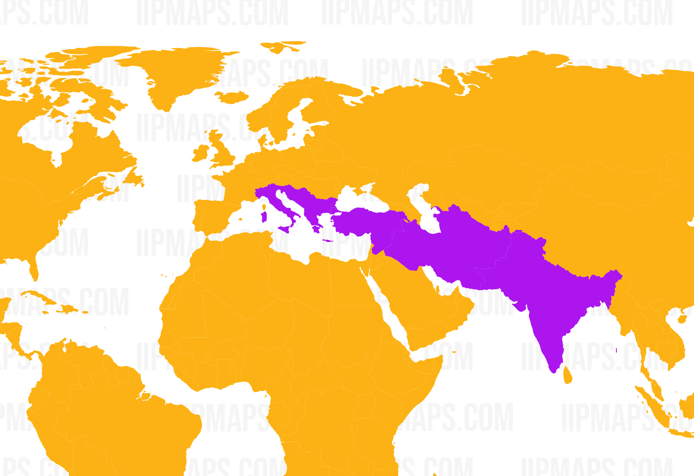
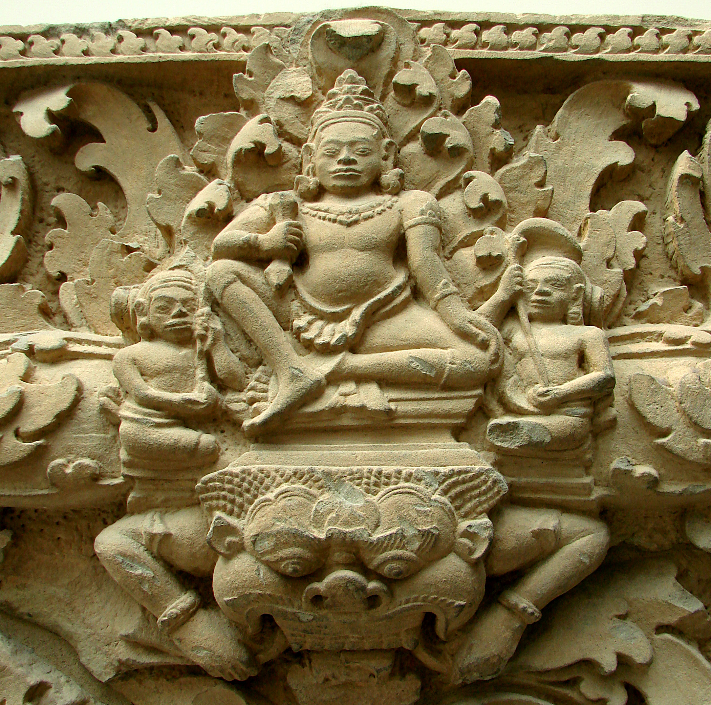
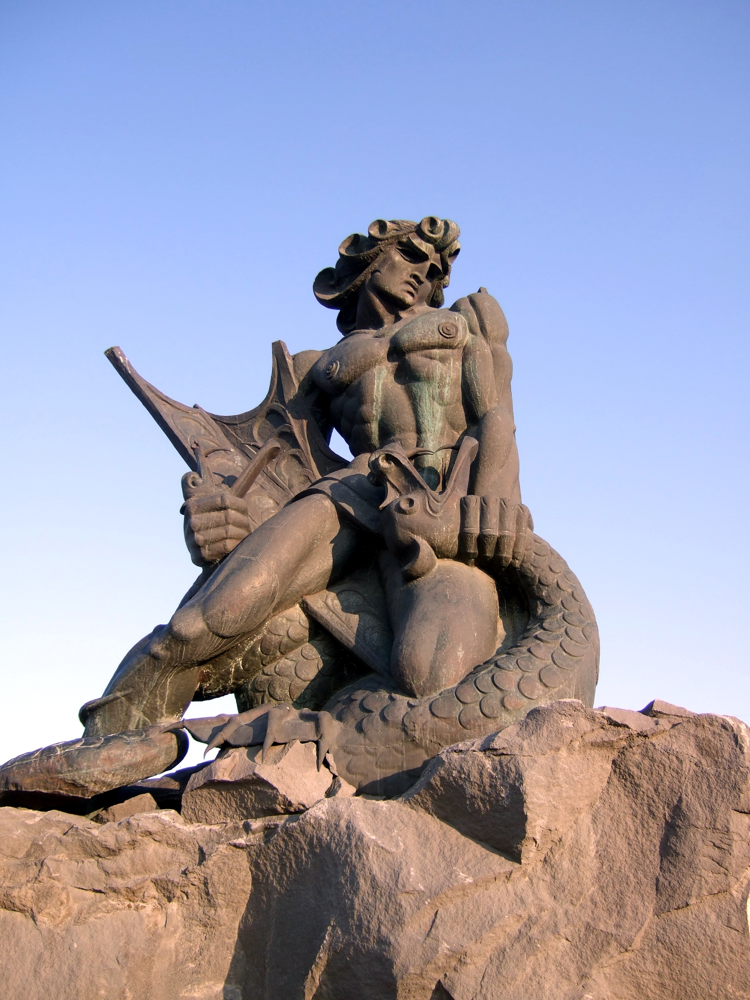

# Dragon-slaying myths

Dragons are mythical monsters that look like giant reptiles. The etymology of the word suggests that _dragon_ is derived from the Greek word _drakōn_, which means _snake_ [^1]. Snakes have, from the earliest times, been feared because of their human-killing venomous bite. It was easy for the ancients to imagine anything fearsome and cruel to be a dragon, and any person overcoming or killing such a menace to be a hero, worthy of adulation.

Here are some dragon-killing myths that have been handed down through generations by means of oral tradition and folklore. These myths are all from the region that lies between India and Italy.

## Myth 1: Indra and Vritra (India) 

There was once a demon called Vritra. He went and stole the cows of the gods and hid the cows in a cave. The cave was guarded by Vritra's army of the Panis, who had also helped him in the stealing operation. 

Upon discovering that their cattle was missing, the gods sent their dog, Sarama, to look for the cows. Sarama located the cave where the cows were hidden, and, acting as a messenger of the gods, asked the Pani guards to hand the cattle over to her. The Panis refused. Instead, they offered to not only make her their sister but also the owner of the cattle, provided she switched over to their side. Sarama refused, went back to the gods, and revealed the location of the cave [^2]. 

Thereupon, Indra, the king of the gods, gathered his army around, fortified himself with Soma, and attacked Vritra and his Pani troops. Indra took up his thunderbolt and hurled it towards Vritra with a huge roar. The thunderbolt struck Vritra down dead, and split open the mountain that was concealing the cattle herd, who ran out towards the waiting gods. The Rig Veda describes this event several times, for example, in the following verses:

!!! note ""

    -  Indra destroyed Vritra, the lurking demon, 
	and made manifest the stolen kine hidden in the night [^3].
	
	-  Indra, the slayer of Vritra, 
	shakes the hiding place of the numerous herd of kine [^4].

<figure markdown="span">

<figcaption>Relief panel from the Phnom Kulen National Park in Cambodia showing Indra overpowering Vritra Vassil - Own work, Public Domain   https://commons.wikimedia.org/w/index.php?curid=2724995</figcaption>
</figure>	

## Myth 2: Trita Aptya and Trishira (India)
 
There were once three boys, Trita, and his brothers Eka and Dvita, who were the son of Agni and born from the waters. Once, when the three brothers were going somewhere in quest of money, Trita was pushed into a well by his brothers, who then covered the well with a cartwheel and left, leaving Trita to die. Trita prayed to the gods, and with their help, threw open the wheel covering the well and emerged, to go and claim his ancestral weapons [^5]. So, this was Trita.

Then, there was also Trishira, who was the three-headed son of Tvashtri (master forger of the gods). With one of his heads, Trishira ate his food, with the second, he drank the Soma juice, and with the third, he recited the Vedas. Trishira was a guardian of cows. 

Indra, the king of the gods, became fearful of Trishira's power and thought he might be deposed by Trishira. Indra, therefore, wanted Trishira dead. For this purpose, he incited Trita, who then killed Trishira and released his cows [^6]. In this endeavour, Trita was aided by the wind gods. This event is described in the following manner in the Rig Veda:

!!! note ""

    -  They (the winds) have come to the aid of the warring Trita [^7]. 
    
	-  He, the son of waters, incited by Indra, skilled in his weapons, 
	slew the three-headed son of Tvashtri and set free the cows [^8]. 

## Myth 3: Thraetaona and Azi Dahaka (Persia)

Azi Dahaka was a three-headed, deceitful monster that was created by the dark force called Angra Mainyu. 

Seeking a boon that he may clear the world of humankind, the monster performed a sacrifice to the goddess Anahita:

!!! note ""

    To her did Azi Dahâka, the three-mouthed, offer up a sacrifice…"Grant me this boon, O good, most beneficent Ardvi Sûra Anâhita! that I may make all the seven Karshvares of the earth empty of men." Ardvi Sûra Anâhita did not grant him that boon [^9]. 

Anahita did not grant Azi Dahaka his boon. Instead, she blessed Thraetaona, son of Athwya, who begged of her a boon that he may kill Azi Dahaka and set free the monster's two wives. 

!!! note ""

    ...that I may overcome Azi Dahâka, the three-mouthed, the three-headed, the six-eyed, who has a thousand senses, that most powerful, fiendish Drug, that demon, baleful to the world, the strongest Drug that Angra Mainyu created against the material world, to destroy the world of the good principle; and that I may deliver his two wives, Savanghavâk and Erenavâk, who are the fairest of body amongst women, and the most wonderful creatures in the world [^10]. 

His wish having been rejected by Anahita, Azi Dahaka now prayed to the god Vayu:
 
!!! note ""

    Grant me this, O Vayu! who dost work highly, that I may make all the seven Karshvares of the earth empty of men [^11]. 

But Vayu, too, did not grant Azi Dahaka his request.  Instead, just like Anahita had done, Vayu too granted Thraetaona his wish that he may gain victory over Azi Dahaka.

!!! note ""

    Grant me this, O Vayu! who dost work highly, that I may overcome Azi Dahâka, the three-mouthed, the three-headed, the six-eyed, who has a thousand senses, that most powerful, fiendish Drug, that demon baleful to the world, the strongest Drum... [^12]

Thraetaona then defeated Azi Dahaka, and bound him to the mountain Damavant, where the monster is to remain till the end of the world, when he'll be finally killed by Keresâspa. The exploit of Thraetaona is described inthe Zend Avesta in the following manner:

!!! note ""

    Athwya, was the second who prepared me for the corporeal world. This blessedness was given him, this gain did he acquire, that to him a son was born, Thraetaona of the heroic tribe, who smote the dragon Dahak, three jawed and triple-headed, six-eyed, with thousand powers, and of mighty strength, a lie-demon of the Daevas, evil for our settlements, and wicked, whom the evil spirit Angra Mainyu made as the most mighty Drugk against the corporeal world, and for the murder of our settlements, and to slay the homes of Asha [^13].
	
Keresâspa, who is fated to kill Azi Dahaka at the end of time, is none other than the son of Thrita, and has overpowered many monsters and evil beings. This is described in the Zend Avesta in the following manner: 

!!! note ""

    ...youth of great ascendant, ringlet-headed, bludgeon-bearing. He who smote the horny dragon swallowing men, and swallowing horses, poisonous, and green of colour, over which, as thick as thumbs are, greenish poison flowed aside, on whose back once Keresâspa cooked his meat in iron caldron at the noonday meal... [^14]
	
## Myth 4: Vahagn and Azhdahak (Armenia) 

Vahagn belongs to the Armenian gods trinity, along with two other gods, namely, Armazd and Anahit. In Yerevan, Armenia, stands a huge rock-cut statue of the god Vahagn killing a serpent dragon.

<figure markdown="span">

<figcaption>Statue of Vahagn the Dragon Slayer choking a dragon in Yerevan, Armenia Chaojoker - Own work, CC BY-SA 3.0 https://commons.wikimedia.org/w/index.php?curid=26731941</figcaption>
</figure>

Much of Armenia's folklore has been lost after its changeover to Christianity, but the country has long had an oral tradition about Vahagn dragging serpents and monsters out of Lake Van and throwing them up to the sun to be burnt to death [^15]. 

The story about killing the monster Azhdahak is recounted in a song by Moses Khorenatsi [^16], which begins by describing the god's birth in the following manner:

!!! note ""

    In travail were heaven and earth,
	
    In travail, too, the purple sea!
	
    The travail held in the sea the small red reed.
	
    Through the hollow of the stalk came forth smoke,
	
    Through the hollow of the stalk came forth flame,
	
    And out of the flame a youth ran!
	
    Fiery hair had he,
	
    Ay, too, he had flaming beard,
	
    And his eyes, they were as suns! 

The song goes on to say that Vahagn killed Azhdahak, and is called _Vishapakagh_ because he killed dragons [^17] (in the Armenian language, _vishap_ means 'sea dragon' and _akagh_ means 'slayer'). 

## Myth 5: Hercules and Cacus (Italy) 

Cacus was a fire-breathing monster who lived in the caves around Rome and terrorised the countryside. The entire area around his cave was littered with the heads, bones, and carcasses of the men and animals he had killed and eaten, and the ground was stained with their blood.

Once, it so happened that the hero Hercules, who was shepherding the cows of Geryon to the court of King Eurystheus, stopped to rest near this place. He pastured the cattle at a meadow and went to sleep. As Hercules slept, the monster Cacus was drawn to that place by the sound of the herd. Cacus came down to the meadow and stole away four cows and four bulls, took them to his cave, and barred the entry with a huge boulder.

When Hercules awoke and learnt what had happened, he went up to Cacus's cave to recover the cattle. Being unable to enter the cave, he broke open the mountain top, reached inside and pulled Cacus out, throttled the monster to death, and freed the cows. This entire story is described by Virgil in Chapter VIII of The Aeneid in the following manner:

!!! note ""

    The hero stood
	
    Adverse, with planted feet, and, from the right,
	
    Tugg'd at the solid stone with all his might.
	
    Thus heav'd, the fix'd foundations of the rock
	
    Gave way; heav'n echo'd at the rattling shock.
	
    Tumbling, it chok'd the flood: on either side
	
    The banks leap backward, and the streams divide.
	
    ...
	
    The monster, spewing fruitless flames, he found;
	
    He squeez'd his throat; he writh'd his neck around,
	
    And in a knot his crippled members bound;
	
    Then from their sockets tore his burning eyes:
	
    Roll'd on a heap, the breathless robber lies.
	
    The doors, unbarr'd, receive the rushing day. [^18]  

## Linguistic analysis

In the Indra-Vritra myth, the name _Vritra_ is used interchangeably with _Vala_ and _Ahi_, as seen in the following verses from the Rig Veda:

!!! note ""

    -  You, wielder of the thunderbolt, did open the cave of Vala, who had there concealed the cattle; and the gods whom he had oppressed, no longer feared when they had obtained you as their ally [^19].

    -  Indra, you have set free the waters that were formerly arrested by Ahi [^20].

    -  Priests! Offer the drink to Indra, who slew the rain-arresting Vritra [^21].

The Sanskrit _Ahi_ is cognate with the Iranian _Azi_ [^22] and Armenian _Azh (օձ)_ [^23], all of which mean a 'snake'.
 
The name of the villain is very similar in the Iranian (_Azi Dahaka_) and Armenian (_Azh Dahak_) myths. 
The Sanskrit suffixes _-ghn_ and _-han_ are cognate with the Iranian _-gn_ and Armenian _-akagh_, all of which mean a 'destroyer or remover of obstacles'. Indra is often referred to as _Vritraghn_ and _Vritrahan_, while Vahagn is called _Vishapakagh_.

_Trita_ of the Trita-Trishira myth can be said to bear a phonetic similarity to the Iranian _Tishtrya_ who fights against the demon _Apaosha_ (drought) and pours liberating rain upon the earth [^24]. However, this aspect needs to be examined in much more detail before a linguistic similarity can be drawn between _Trita_ and _Tishtrya_.

Here's a tabulation of the cognate words from the five myths.

|  | Indra - Vritra | Trita - Trishira | Thraetaona - Azi Dahaka | Vahagn - Azhdahak | Hercules - Cacus |
| ---- | ---- | ---- | ---- | ---- | ---- |
|Hero's epithet | Vritrahan, Vritraghn | - | Verethregn | Vishapakagh | - |
|Hero's parent | - | Ap|Athwya | -|- |
| Villain's name or epithet|Ahi |- | Azi, Vishay [^25]| Azh, Vishap|- |
|Hero's drink  |Soma |- |Haoma |- |- |
|Hero's looks [^26] |Svarsha |- |Hwarez |Xarteas |- |
| Hero's weapon [^27]|Vajra | - | Vadar | - | - |

From a linguistic standpoint, it seems that the Hercules-Cacus myth is an outlier. However, in the ancient Greek language, the word _Cacus (κακός)_ means _bad or evil_ [^28], and some research is needed to see whether the Iranian and Armenian _Dahak_ are cognate with _Cacus_.
 
It also seems that, linguistically, the Trita-Trishira myth belongs only tentatively to the group through its connection to the Thraetaona-Azi Dahaka myth by the 'water'-word _Ap_. Keresâspa, who will kill Azi Dahaka at the end of time, is the son of Thrita. Further research is needed to see whether this Thrita is related to Trita.

The other three myths, namely, the Indra-Vritra myth, the Thraetaona-Azi Dahaka myth, and the Vahagn-Azhdahak myth, have several linguistic similarities among them.

## Psychological analysis

These five myths can be examined through the lens of the following two archetypes: 

- The archetype of good-versus-evil 
- The archetype of the hero 

In the Indra-Vritra myth, Indra is the hero who, aided by other gods, kills the evil Vritra who has imprisones the cows (which is an analogy for obstructing the rainwaters) and has, as a result, brought drought upon the earth. Vritra has been repeatedly called a demon. Azi Dahaka is evil personified as he openly declared his intention of ridding the world of humans, and it needs two heroes to overcome him, namely, Thraetaona, who chains him up, and Keresâspa, who will kill him. Vahagn is a hero who plays with evil dragons. Hercules heroism lives so long that when he dies, he is turned into a star by his father Zeus [^29]. It is only in the Trita-Trishira myth that an archetype is not evident; the story seems to be one of petty jealousy on the part of Indra who then incites Trita to kill Trishira, and contains neither a hero archetype nor a good-versus-evil archetype. 

Here's a tabulation of the archetypes in these myths.

|  | Indra - Vritra | Trita - Trishira | Thraetaona - Azi Dahaka | Vahagn - Azhdahak | Hercules - Cacus |
| ---- | ---- | ---- | ---- | ---- | ---- |
|Hero archetype? | Yes | No |  Yes | Yes | Yes |
|Good-versus-evil archetype? |Yes | No| Yes |Yes |Yes |

From a psychological standpoint, therefore, the Trita-Trishira myth does not belong to the same class as the other four myths.

## Structural analysis

All of these myths have a common basic structure of a three-headed being who is killed by a god or demigod. 

In all of the cases, except in the Trita-Trishira myth, this three-headed being lives inside a cave or likes to hide in a mountain or inside a lake. The antipathy to light and open spaces is evident. 

In all of the cases, except in the Vahagn-Azhdahak myth, cattle is involved. 

In all of the cases, except in the Trita-Trishira myth, a water body is involved: the cows in the two Vedic stories are euphemisms for water - whether rain or river [^30] - and the serpent [^31] and its cave is a personification of clouds [^32] that obstruct the light ('light' is another word for 'cow' [^33]) and waters; Trita is called _Aptya_ because he's a son of water; Thraetaona's father, Athwya, is related to water too, as is Vahagn who, besides being born of the water, also drags serpents out of the waters of Lake Van and kills them; Hercules's breaking of the mountains to bring out Cacus resulted in the rivers breaching their banks.
 
The structural similarities among these myths can be tabulated in the following manner. 

|  | Indra - Vritra | Trita - Trishira | Thraetaona - Azi Dahaka | Vahagn - Azhdahak | Hercules - Cacus |
| ---- | ---- | ---- | ---- | ---- | ---- |
|Victor is a god?|Yes|Son of god|Yes |Yes|Son of god|
|Vanquished is three-headed?|No|Yes|Yes|Yes|Yes|
|Cattle is the main reason?|Yes|No|No|No|Yes|
|Waters are involved?|Yes|No|Yes|Yes|Yes|
|Mountains are involved?|Yes|No|Yes|No|Yes|
|Light is involved?|Yes|No|Yes|No|No|

From a structural standpoint, it looks like the Trita-Trishira myth is an outlier for this group, and is structurally not really similar to them except for the part about the vanquished being a three-headed being. 
## Historical and comparative analysis

Historical evidence for Indra and Trita are non-existent. 

Because of the pervading cultural influence of Iran over Armenia for a very long time, the Iranian Verethergn became the Armenian Vahagn [^34]. In later Armenian lore, Vahagn is a king who had once been worshipped as a god, and from whom the hereditary high priests of Armenia claimed descent [^35]. In the Hellenic times, Vahagn was linked to Hercules.

<figure markdown="span">

<figcaption>Hellenistic-era depiction of Verethragna as Heracles, carved in 148 BCE at Kermanshah, Iran Alieh - Flickr, CC BY 2.0  https://commons.wikimedia.org/wiki/index.%20php?curid=1654040 Verethragna (Bahram) reclines with a goblet in his hand, a club at his feet and a lion-skin beneath him.</figcaption>
</figure>

 The monuments at Mount Nemrut, Turkey, erected by Antiochus I Theos of Commagene [^36], show that both the Iranian Verethregn (Thraetaona) and the Armenian Vahagn were identified with Hercules [^37]. 

From a historical and comparative perspective, therefore, it would seem that the Thraetaona, Vahagn, and Hercules myths are related. However, there is no historical evidence for the actual existence of these heroes.

## Naturalistic analysis

Trita is connected with water by his very name _Aptya_ (meaning, 'born of water'). Also, Trita (meaning, 'third') is the third form of the god of fire, which is the lightning that releases the pent up waters in the clouds [^38]. Indra, too, is a lightning-wielder and brings down dark 'clouds' from the sky so that the waters can be released. Both these gods are helped by the wind gods when they pierce the cloud mountains. Thus, both Trita and Indra can be said to be manifestations of the natural phenomenon of lightning. 

Trita and Thraetaona are both linked to fire. Thraetaona has later been called Behram [^39]. Whether the Iranian fire, known as _Atash-e-Bahram_ (meaning, 'the fire of Behram') is in any way related to Trita, Thraetaona, or the natural event of lightning, needs further research. 

The myths of Vahagn and Hercules do not seem to show any connection with any natural phenomenon. 

## Phylogenetical 

Indra and Trita both kill a demon, and both are helped by the wind gods. Trita was a god in the times of the Rig Veda but by later vedic times, Trita was only a rishi [^40]. In quite a few places in the Rig Veda, Trita is also associated with Soma, the drink of the gods [^41]. He is seen as preparing the Soma and offering it to the gods. While Indra (along with Agni) has the maximum number of verses in the Rig Veda addressed to him, there are about only forty Rig Veda verses that mention Trita and, in many of them, he is only the poet and not the god being invoked. It would seem that, over a period of time, Trita's god-ness was appropriated by Indra [^42]. 

Trita kindled fire and brought it to earth [^43]. In this function, he is similar to the Iranian Thraetaona, also called Verethregn, who, in later Iranian lore, became Behram [^44]. 

Thraetaona's father Athwya is someone who prepares the Haoma, just like Trita (also called Aptya) is seen preparing the Soma in the later Rig Vedic hymns. Whether Trita and Athwya are related needs to be studied further. 

Thraetaona of the Zend Avesta becomes, in later Persian literature, a prince called Faridun who battles with a cruel king named Zahhak, whose evilness stemmed from two snakes that lived on his shoulders. Faridun gathers an army, marches against Zahhak, is helped in his quest by the two sisters of Jamshid, defeats Zahhak, and ties him up in the Damawand mountains [^45]. Whether this later story (composed around the 11th century AD) is in any way related to the myth of the Iranian Jamshid and Yima (both of whom are connected to light and sun) needs further research.

## Conclusion 

Taking into consideration the analysis outlined in the preceding paragraphs, a comparison of these five myths can be tabulated as follows: 

|  | Indra - Vritra | Trita - Trishira | Thraetaona - Azi Dahaka | Vahagn - Azhdahak | Hercules - Cacus |
| ---- | ---- | ---- | ---- | ---- | ---- |
|Linguistic|:material-check:|:question:|:material-check:|:material-check:|:x:|
|Psychological|:material-check:|:x:|:material-check:|:material-check:|:material-check:|
|Structural |:material-check:|:x:|:material-check:|:material-check:|:material-check:|
|Historical and comparative|:x:|:x:|:material-check:|:material-check:|:material-check:|
|Naturalistic|:material-check:|:material-check:|:question:|:x:|:x:|
|Phylogenetical|:material-check:|:material-check:|:question:|:x:|:x:|

It can be seen from this table that a fair amount of correlation exists between the myths of Indra-Vritra, Thraetaona-Azi Dahaka, and Vahagn-Azhdahak.
 
It is also seen that a fair amount of correlation exists between Thraetaona, Vahagn and Hercules, and between the Indra and Trita. It might be interesting to study whether there is any correlation between Trita and Thraetaona. 

From the myths themselves, it might not be erroneous to say that the people (and the civilisation) of Armenia, Iran, and India might have, at some extremely antiquated time, either had a common ancestor group or were so interwoven socially that their conception of divinity and evil had very similar shades that differed only slightly. It might also not be erroneous to say that when some of these regions started believing in a newer god-system, they sought to merge or assimilate their existing stories into the new myths that were thenceforth propagated. 

A fuller study of these myths, with focus on the following points will surely reveal interesting links: 

-  Whether the Iranian and Armenian _Dahak_ is cognate with the Roman _Cacus_
-  Whether the Iranian Thrita, father of Keresâspa, is related to the Indian Trita 
-  Whether Atash-e-Bahram is related to Trita, Thraetaona, or the natural event of lightning 
-  Whether the Faridun story is related to the Iranian myth of Jamshid/Yima
-  Whether the Iranian Thraetaona is related to the Indian Trita 

## Bibliography

-  Al-Salihi, W., 1971. _"Hercules-Nergal at Hatra" On JSTOR_. (online) Jstor.org. Available at: <https://www.jstor.org/stable/4199919> (Accessed 10 February 2024).
-  American Heritage Dictionary. Meaning and etymology of dragon. (online) Available at: <https://ahdictionary.com/word/search.html?q=dragon> (Accessed 10 February 2024).
-  Darmesteter, J. and Millis, L., 1883. _The Zenda Avesta_. Oxford: Clarendon. 
-  Dryden, J., 1937. _Virgil's Aeneid_. New York: P. F. Collier and Son Corporation. 
-  Hastings, J., Selbie, J. and Gray, L., 1926. _Encyclopædia Of Religion And Ethics_. Edinburgh: T & T Clark. 
-  Hewson, R., 1975. _"The Primary History Of Armenia": An Examination Of The Validity Of An Immemorially Transmitted Historical Tradition On JSTOR_. (online) Jstor.org. Available at: <https://www.jstor.org/stable/3171466> (Accessed 10 February 2024). 
-  Iranicaonline.org. 2020. _ANTIOCHUS OF COMMAGENE – Encyclopaedia Iranica_. (online) Available at: 
<https://iranicaonline.org/articles/antiochus-of-commagene> (Accessed 10 February 2024). 
-  Kurkjian, V., 1958. _A History of Armenia_. Armenia: Armenian General Benevolent Union of America. 
-  Liddell, H., Scott, R., Jones, H. and McKenzie, R., n.d. [_Liddell, Scott, And Jones Greek Lexicon (Online)_]. [Medford, MA]: [Perseus Digital Library, Tufts University, Classics Dept.]. 
-  Macdonell, A. and Keith, A., 2007. _Vedic Index Of Names And Subjects_. Delhi: Motilal Banarsidass. 
-  MacDonell, A., 1893. _"Mythological Studies in the Rigveda." Journal of the Royal Asiatic Society of Great Britain and Ireland On JSTOR_. (online) Jstor.org. Available at: <https:// www.jstor.org/stable/25197152> (Accessed 10 February 2024). 
-  Macdonell, A., 2000. _Vedic Mythology_. New Delhi: Munshiram Manoharlal Publishers. 
-  Mani, V., 1979. _Purānic Encyclopedia_. Delhi: Motilal Banarsidass. 
-  Nayiri.com. 2020. _Nayiri.Com_. (online) Available at: 
<http://www.nayiri.com/search?l=fr&dt=HY_EN&r=0&query=%D6%85%D5%B1> (Accessed 10 February 2024). 
-  Ovid, Dryden, J., Pope, A., Congreve, W. and Addison, J., 1833. _Ovid_. London: A.J. Valpy. 
-  Russell, J., 2007. _"The Shrine Beneath The Waves" On JSTOR_. (online) Jstor.org. Available at: <https://www.jstor.org/stable/20167721> (Accessed 10 February 2024). 
-  Sāyaṇa, Wilson, H., Arya, R. and Jośī, K., 2001. _Ṛgveda-Saṁhitā_. Delhi: Parimal. 
-  Tripathi, G., 2011. _Vaidika Devatā_. Naī Dillī: Rāshtriya Samskr̥ta Samsthāna. 
 -  Varandyan, E., 1961. _"Legends And Poems From Armenia" On JSTOR_. (online) Jstor.org. Available at: <https://www.jstor.org/stable/40115293> (Accessed 10 February 2024). 
-  Warner, A. and Warner, E., 1905. _The Shahnama Of Firdausi_. London: Kegan Paul, Trench, Trübner & Co. Ltd.

[^1]: [Meaning](https://ahdictionary.com/word/search.html?q=dragon) and [etymology](https://www.ahdictionary.com/word/indoeurop.html) of _dragon_ at The American Heritage Dictionary online (Accessed 10 February 2024).
[^2]: Rig Veda 10.108.
[^3]: Rig Veda 3.34.3 
[^4]: Rig Veda 8.66.3 
[^5]: Sāyaṇa, Wilson, H., Arya, R. and Jośī, K., 2001. Ṛgveda-Saṁhitā. Delhi: Parimal, pp.133-134. 
[^6]: Mani, V., 1979. Purān 
ic Encyclopedia. Delhi: Motilal Banarsidass, p.795. 
[^7]: Rig Veda 8.7.24 
[^8]: Rig Veda 10.8.8 
[^9]: Yast V, Aban Yast, Chapters VIII-IX, Verses 28-32 
[^10]: Yast V, Aban Yast, Chapters VIII-IX, Verses 33-35 
[^11]: Yast XV, Ram Yast, Verse 20 
[^12]: Yast XV, Ram Yast, Verses 24-2513 Yasna IX, Hom Yast, Verses 7-8 
[^14]: Yasna IX, Hom Yast, Verses 10-11 
[^15]: Russell, J., 2007. The Shrine Beneath The Waves On JSTOR. (online) Jstor.org. Available at: [https://www.jstor.org/stable/20167721](https://www.jstor.org/stable/20167721) (Accessed 10 February 2024). 
[^16]: Kurkjian, V., 1958. A History of Armenia. Armenia: Armenian General Benevolent Union of America, p.300. 
[^17]: Varandyan, E., 1961. Legends And Poems From Armenia On JSTOR. (online) Jstor.org. Available at: [https://www.jstor.org/stable/40115293](https://www.jstor.org/stable/40115293) (Accessed 10 February 2024). 
[^18]: Dryden, J., 1937. Virgil's Aeneid. New York: P. F. Collier and Son Corporation, pp.274-277.  
[^19]: Rig Veda 1.11.5 
[^20]: Rig Veda 2.11.1 
[^21]: Rig Veda 2.14.2 
[^22]: Tripathi, G., 2011. Vaidika Devatā. Naī Dillī: Rāshtriya Samskr̥ta Samsthāna, p.111. 
[^23]: Nayiri.com. 2020. Nayiri.Com. (online) Available at: 
[http://www.nayiri.com/search?l=fr&dt=HY_EN&r=0&query=%D6%85%D5%B1](http://www.nayiri.com/search?l=fr&dt=HY_EN&r=0&query=%D6%85%D5%B1) (Accessed 10 February 2024). 
[^24]: Hastings, J., Selbie, J. and Gray, L., 1926. Encyclopædia Of Religion And Ethics. Edinburgh: T & T Clark, p.798. 
[^25]: Tripathi, G., 2011. Vaidika Devatā. Naī Dillī: Rāshtriya Samskr̥ta Samsthāna, p.95. 
[^26]: Ibid, p.95. 
[^27]: Ibid, p.95. 
[^28]: Liddell, H., Scott, R., Jones, H. and McKenzie, R., n.d. [Liddell, Scott, And Jones Greek Lexicon (Online)]. [Medford, MA]: [Perseus Digital Library, Tufts University, Classics Dept.]. 
[^29]: Ovid, Dryden, J., Pope, A., Congreve, W. and Addison, J., 1833. Ovid. London: A.J. Valpy, p.277. 
[^30]: Macdonell, A., 2000. Vedic Mythology. New Delhi: Munshiram Manoharlal Publishers, pp.10, 12, 59, 61, 108, 150. 
[^31]: Ibid, p.158. 
[^32]: Ibid, p.159. 
[^33]: Ibid, p.27. 
[^34]: Hastings, J., Selbie, J. and Gray, L., 1926. Encyclopædia Of Religion And Ethics. Edinburgh: T & T Clark, p.799. 
[^35]: Hewson, R., 1975. "The Primary History Of Armenia": An Examination Of The Validity Of An Immemorially Transmitted Historical Tradition On JSTOR. (online) Jstor.org. Available at: [https://www.jstor.org/stable/3171466](https://www.jstor.org/stable/3171466) (Accessed 10 February 2024). 
[^36]: Iranicaonline.org. 2020. ANTIOCHUS OF COMMAGENE – Encyclopaedia Iranica. (online) Available at: [https://iranicaonline.org/articles/antiochus-of-commagene](https://iranicaonline.org/articles/antiochus-of-commagene) (Accessed 10 February 2024).
[^37]: Al-Salihi, W., 1971. "Hercules-Nergal at Hatra" On JSTOR. (online) Jstor.org. Available at: [https://www.jstor.org/stable/4199919](https://www.jstor.org/stable/4199919) (Accessed 10 February 2024). 
[^38]: MacDonell, A., 1893. "Mythological Studies in the Rigveda." Journal of the Royal Asiatic Society of Great Britain and Ireland On JSTOR. (online) Jstor.org. Available at: [https://www.jstor.org/stable/25197152](https://www.jstor.org/stable/25197152) (Accessed 10 February 2024). 
[^39]: Tripathi, G., 2011. Vaidika Devatā. Naī Dillī: Rāshtriya Samskr̥ta Samsthāna, p.111.  
[^40]: Macdonell, A. and Keith, A., 2007. Vedic Index Of Names And Subjects. Delhi: Motilal Banarsidass, p.i. 329. 
[^41]: Rig Veda 9.32, 9.34, 9.38 
[^42]: Macdonell, A., 2000. Vedic Mythology. New Delhi: Munshiram Manoharlal Publishers, p.69. 
[^43]: Ibid, p.68. 
[^44]: Tripathi, G., 2011. Vaidika Devatā. Naī Dillī: Rāshtriya Samskr̥ta Samsthāna, p.111.  
[^45]: Warner, A. and Warner, E., 1905. The Shahnama Of Firdausi. London: Kegan Paul, Trench, Trübner & Co. Ltd., pp.159-170.

