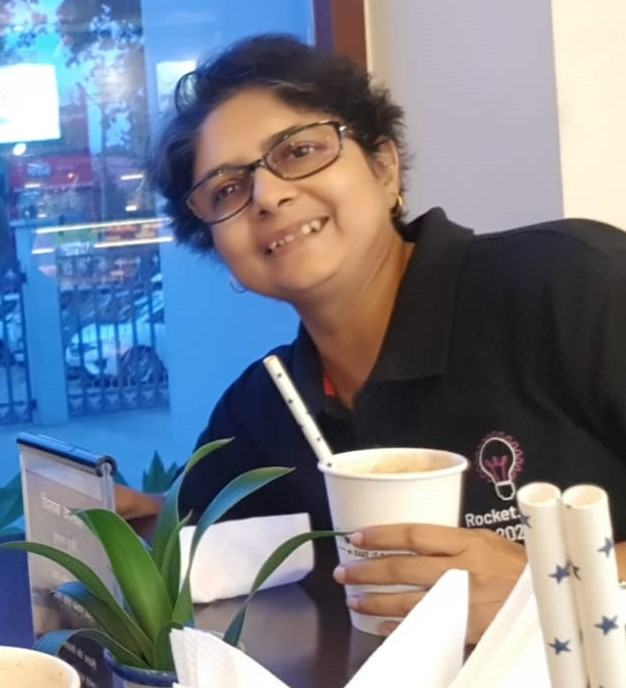

---
myst:
  html_meta:
    "title": "Anindita Basu"
    "description": "A technical writer for bread and butter. Many other things otherwise."
    "author": "Anindita Basu"
    "image": "https://comparative-mythology.readthedocs.io/en/latest/_static/ab.jpg"
    "og:type": "website"
    "og:title": "Anindita Basu"
    "og:description": "A technical writer for bread and butter. Many other things otherwise."
    "og:image": "https://comparative-mythology.readthedocs.io/en/latest/_static/ab.jpg"
    "twitter:card": "summary_large_image"
    "twitter:title": "Anindita Basu"
    "twitter:description": "A technical writer for bread and butter. Many other things otherwise."
    "twitter:image": "https://comparative-mythology.readthedocs.io/en/latest/_static/ab.jpg"
---


# Hi!

My name is Anindita Basu. In my day job as a technical writer, I make unfamiliar things look less frightening. In my other roles, I drink coffee and do things.

```{admonition} How to pronounce my name
ʌnɪndɪtɑː (uh-nin-di-taa)
```
```{margin}

```

I was born and raised in [Allahabad](https://goo.gl/maps/3TMsUm9o7y1Ywoyq8). I studied the sciences, took a business degree, worked in the public sector for a decade, and then switched careers to join the technology industry, where I plan to spend the rest of my working life.

I'm fond of languages, books, movies, and music (and don't like cats, crowds, and cooking). I am fascinated by ancient India, and out of that fascination grew an [API around the Vedas](https://aninditabasu.github.io/indica/) and a [query service around the Mahabharat](https://mahabharat.onrender.com/). I also self-published [three tiny books](https://www.amazon.in/Anindita-Basu/e/B0754355DX).

```{admonition} Where to find me
-  Twitter: [@anindita_basu](https://twitter.com/anindita_basu)
-  LinkedIn: [aninditabasu](https://www.linkedin.com/in/aninditabasu/)
```
